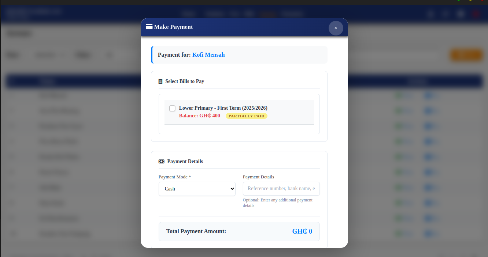

# School Fees Tracker - Feature Documentation

**Version:** 3.0  
**Platform:** Desktop (Electron + SQLite)

The School Fees Tracker is a comprehensive management application designed for school administrators to efficiently manage student data, define fee structures, track bills, and record payments.

---

## Core Features

### 1. Dashboard & Navigation

- **Central Dashboard**: Quick access hub to main functional areas (Students, Fees, Bills, Payments)
- **Context Indicator**: Displays current Academic Year and Term in the navigation bar
- **Year/Term Context**: All administrative actions are automatically applied to the selected period

### 2. Student Management

#### Student Roster

- Sortable and searchable student table
- Class-based organization with sidebar quick counts
- Class groupings: Nursery, JHS, SHS, and more

#### Add/Edit Student

- Simple modal interface for student registration
- Fields: First Name, Last Name, Other Names
- Quick class assignment

#### Student Details View

- Complete student profile with current class and academic year
- **Billing History**: Full record showing:
  - Original fee amount
  - Applied discounts
  - Net amount
  - Total paid
  - Remaining balance (per term)
- **Payment Records**: Detailed transaction history including:
  - Payment date
  - Amount paid
  - Payment mode (MOMO, Cash, Cheque, etc.)

### 3. Fee Structure Management

#### Fee Definition

- Add fees for specific Class, Academic Year, and Term
- Simple configuration interface
- Flexible fee amounts per context

#### Billing Summary

- Comprehensive list of all defined fee structures
- Student billing counts per fee structure
- Overview of billed vs unbilled students

#### Class Billing View

- Drill-down view by class and term
- Live billing status showing:
  - Total fees
  - Amount paid
  - Outstanding balance
  - Payment status (Paid/Partial/Unpaid)
- **Summary Row**: Aggregated totals for the entire class
- **Quick Actions**:
  - View student details
  - Record new payment
  - Apply discount (percentage-based)

### 4. Payment Processing

#### Payment Modal

- Current financial context display:
  - Total Fees
  - Amount Paid
  - Arrears
- **Flexible Payment Entry**:
  - Custom payment amount
  - Payment mode selection (MOMO, Cash, Cheque)
  - Additional payment details field

### 5. Configuration & Settings

#### Global Context Management

- Set default Academic Year and Term
- System-wide context application

#### Structural Management

- **Manage Classes**: Full CRUD operations for class definitions
- **Manage Academic Years**: Full CRUD operations for academic year setup

---

## Advanced Features

### 6. Financial Tracking & Arrears Management

#### Arrears Module

- Dedicated page listing students with outstanding balances
- Filterable by Year and Class
- Direct actions: View student details, Pay arrears

#### Payment Allocation

- **Select Bills to Pay**: Precise payment allocation to specific outstanding terms/invoices
- Multi-bill payment support
- Clear balance tracking

#### Payments History

- Sortable, filterable transaction list
- Complete payment mode and details tracking
- Comprehensive audit trail

#### Payment Modification

- Update payment records for error correction
- Modify payment amount or payment mode
- Maintain payment history integrity

#### Payment History Modal

- Complete bill payment history
- Shows: Total Fees, Discount Applied, Total Paid, Balance
- Transaction-level detail view

### 7. Financial Dashboard

#### Executive Metrics

Real-time financial indicators:

- Total Students
- Total Billed
- Total Paid
- Pending Payments
- Discounts Given

#### Billing Status Overview

- Billed vs Unbilled Students count
- Billed vs Unbilled Classes count
- Visual status indicators

#### Class Summary Table

Detailed breakdown by class showing:

- Total Billed
- Discounts Applied
- Total Paid
- Total Outstanding Balance

### 8. Enhanced Student & Class Management

#### Class Roster Management

- Manage students within specific classes
- **No Class Students** sidebar for easy assignment
- Drag-and-drop or form-based student assignment

#### Unbilled Status View

- Clear distinction between billed and unbilled students
- Actions available:
  - Remove student from class
  - Bill entire class
  - Individual student billing

---

## Technical Specifications

- **Framework**: Electron (Desktop Application)
- **Database**: SQLite (Local Storage)
- **Deployment**: Desktop-based, single-instance
- **Data Persistence**: Local database with full CRUD operations

---

## Status

**Current Version**: 1.0 (Stable)

This application provides a complete, stable feature set for local, day-to-day fees and student management with advanced financial tracking capabilities.
